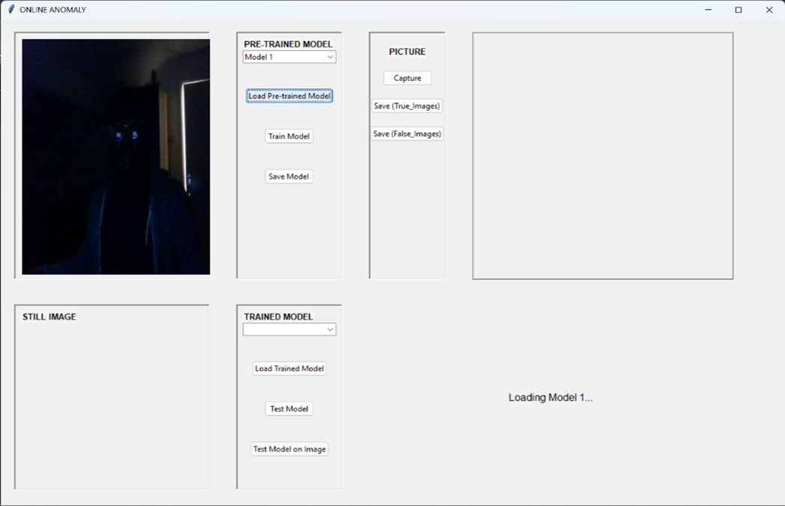
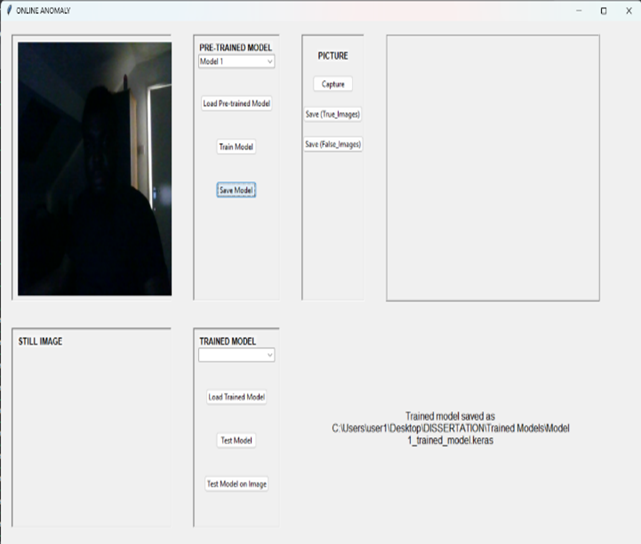
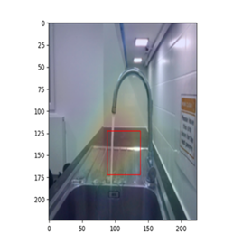
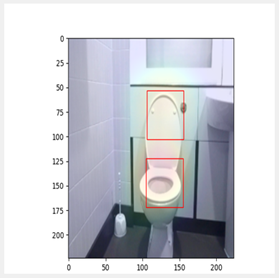
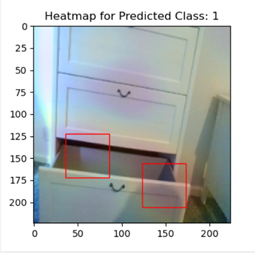
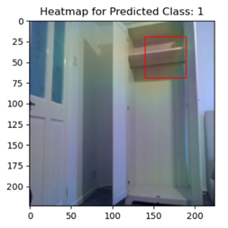

# Online-Anomaly-Detection

<h2>Description</h2>
A robust, real-time anomaly detection system that not only identifies unusual patterns in a domestic environment but also pinpoints the exact features causing the anomaly. Developed as a Master's dissertation project, this system combines the power of Deep Learning with an intuitive Graphical User Interface (GUI) for practical, real-world application.

 

<h2>Languages and Utilities Used</h2>

- <b>Python 3.7+</b> 
- <b>TensorFlow 2.x</b>
- <b>OpenCV</b>
- <b>Tkinter</b>
- <b>Other libraries: NumPy, Pandas, Matplotlib, Scikit-learn</b>

<h2>Environments Used </h2>

- <b>Windows 11</b> (21H2)
-  <b>Jupyter Notebook</b>
-   <b>Google Collab</b> 

<h2>🚀Projects Highlights</h2>

- **Real-Time Detection:** Processes live camera feeds to identify anomalies instantly
- **Feature Localization:** Uses Grad-CAM to generate heatmaps, visually highlighting the "why" behind an anomaly
- **High Accuracy:** Achieved up to 100% accuracy on specific tasks like toilet lid position and hallway occupancy detection
- **User-Friendly GUI:** Built with Tkinter, allowing for easy model training, testing, and data collection without touching code
- **Domain-Focused:** Tackles practical, real-world problems in home automation and security

<h2>🧠What Problem Does This Solve?</h2>
Anomaly detection is crucial in fields like cybersecurity, healthcare, and industrial monitoring. However, many traditional systems have two key shortcomings: 

 

- <b>They struggle with the complexity and speed of real-world data.</b> 
- <b>They act as a "black box," detecting that something is wrong but not what or where.</b>

This project addresses both by creating an interpretable, online detection system for domestic contexts, such as detecting a running tap, an open drawer, or an intruder in a hallway.
 

<h2>🛠️ How It Works (The Technical Story)</h2>

The system implements a structured pipeline for model management, featuring four specialized deep learning models trained for specific domestic anomaly detection tasks. Each model follows a standardized lifecycle from initialization to testing. The architecture eliminates manual coding requirements through an intuitive GUI   

<h2>One-Click Automated Workflow</h2>

**Load Model:**
System automatically:
- Initializes pre-trained architecture
- Loads optimized weights
- Verifies model integrity
- Updates status: "Model loaded successfully"

 
Load Model:   
 
 
 
 

**Train Model:**
Automated training pipeline:
- Data preprocessing & augmentation
- Transfer learning fine-tuning
- Validation metrics tracking
- Status: "Model trained and optimized"
  

 
Train Model:   
 
 
 
 

**Save Model:**
Model persistence:
 - Weight serialization
 - Architecture preservation
 - Version management
 - Status: "Trained model saved"
   

 
Save Model:   
 
 
 

**Test Model:**
Real-time evaluation:
- Live camera inference
- Heatmap generation
- Performance metrics
- Anomaly localization

  

 
Results:   
 
 
 
 
 
 

<h2>🏗️ System Architecture</h2>

**Deep Learning Backend:**
- **Model:** Transfer Learning with a pre-trained VGG16 architecture, fine-tuned for binary classification.
- **Technique:** Uses Grad-CAM for feature localization, producing heatmaps that show the image regions most influential to the model's decision.
- **Training:** Models are trained on custom datasets of ~200 images per class (e.g., "tap on" vs. "tap off").

**Frontend GUI: Built with Tkinter** 

- **Functionality:**
- <b>Live camera feed display and image captureOne-click model training, loading, and saving.</b> 
- <b>Real-time testing on live images or test datasets.</b>
- <b>Integrated data collection tools.</b>

<h2>📊 Model Performance</h2>

| Model | Task | Accuracy | Precision | Recall | F1-Score |
|-------|------|----------|-----------|--------|-----------|
| Model 1 | Kitchen Tap (Running/Off) | 91.67% | 91.73% | 91.66% | 91.63% |
| Model 2 | Bedroom Drawer (Open/Closed) | 96.83% | 96.99% | 96.83% | 96.81% |
| Model 3 | Toilet Lid (Open/Closed) | **100%** | **100%** | **100%** | **100%** |
| Model 4 | Hallway (Occupied/Empty) | **100%** | **100%** | **100%** | **100%** |

<h2>📈 Results & Analysis</h2>

The models demonstrated exceptional performance, successfully localizing anomalies in real-time. Key insights from the analysis:   

- **Environmental Factors:** Model accuracy was influenced by lighting, shadows, and reflections, highlighting the challenges of real-world deployment.
- **Overfitting:** Models 3 & 4 achieved 100% accuracy, suggesting potential overfitting. Future work would involve expanding the dataset for better generalization.
- **Robustness:** The system proved to be a reliable proof-of-concept for automated monitoring in domestic environments.

<h2>🔮 Future Work</h2>

This project lays the foundation for several exciting advancements:   

- **Enhanced Robustness:** Improve model performance under varying lighting and weather conditions.
- **Semi-Supervised Learning:** Reduce reliance on large, labeled datasets by exploring unsupervised techniques.
- **Broader Applications:** Adapt the system for industrial inspection, public security, or healthcare monitoring.

